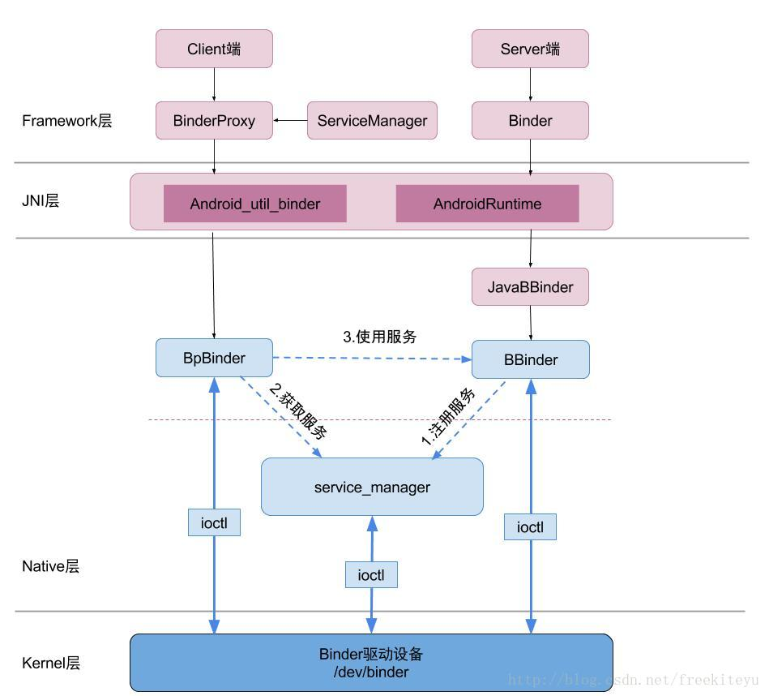
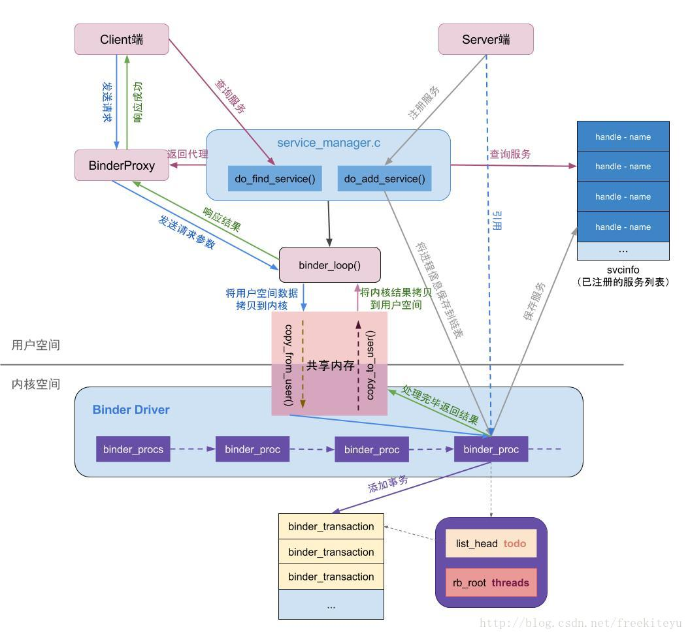
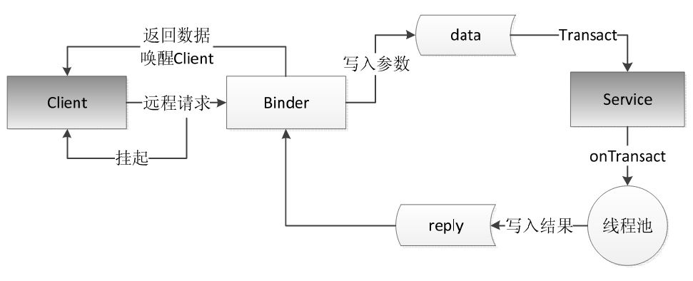

Title: AIDL生成的接口及Binder的分析
Date: 2018-04-01
Tags: aidl, 源码, 分析


[TOC]

### 1. Android 上的 Binder

在原 Linux 上已经有各种 IPC , 管道, 信号, 信号量,  Socket, 共享内存, 互斥锁. 但 Binder 能在 Android 这个特定的平台上会比其他更**高效**, 也更**安全**, 其他`IPC`没有严格权限验证机制

#### 1.1 Binder 的构架

​        Binder 通信是基于 **C/S 构架**. 多个 C 端可以同步连接 S 端, 所以 S 端需要**同步**设置



#### 1-2 Binder 的机制

* 服务端向内核注册服务, 内核生成`binder_proc`的数据结构信息
* 注册之后客户端便可以获取到服务代理, 进而跟服务端通信

  `WindowManager wm = (WindowManager)getSystemService(Context.WINDOW_SERVICE)`
* 这些都是在 native 和内核层帮助我们转换完成



`Java`层的`Binder`主要与几个类(`Binder`, `BinderProxy`, `Stub`)和接口(`IBinder`, `IInterface)`有关

* `IBinder`接口代表了**一种跨进程传输的能力**, 只能类实现了这个接口, 表示能将该类对象进行跨进程传递. 这是由`Android`底层来实现支持的. 系统会对传输的数据(即`IBinder`对象)进行本地和代理间的转换.
* `IInterface`代表的是传输的`IBinder`对象具有什么能力. `AIDL`中自定义接口就是继承该接口
* `Binder`类是内部对`IBinder`的实现, 代表**本地的对象**.`BinderProxy`是`Binder`的内部类, 代表着**远程进程**的`Binder`对象的本地代理
* 在`AIDL`中, 系统会给生成一个静态的内部类`Stub`. 继承了`Binder`同时实现了`IInterface`接口. 这说明这是一个本地的`Binder`, 并且可以作为远程`Server`来给`Client`传递数据的能力. 其内部真正使用**策略模式**来交给`Stub.Proxy`处理数据的交换

### 2. AIDL 文件实现分析

在系统自动生成的`BookManager.java`中, 主要结构:

* `BookManager`扩展`andorid.os.IInterface`接口
* 两个内部静态类`Stub`, `Proxy`内部类分别实现`BookManager`接口. 但`Stub`是一个抽象类. 其具体实现由`server`端来实现. 在`client`中请求`server`返回的实例里, 由`Stub#Proxy`代理去向`server`做出请求连接
* 使用`BookManager.Stub.asInterface()`方法返回`BookManager`实例, 实际就是内部`Proxy`代理类的实现
* `BookManager.Stub.asBinder()`方法, 返回当前的`binder`对象
* 当在`client`请求`BookManger`的方法时, 调用`Proxy`内对应实现的方法. 方法内部调用了`Binder#transact()`. `transact()`在内部调用了`IBinder#onTransact()`. 由于`mRemote`是`Stub`的实例, 这便是调用了`Stub#onTransact()`方法. 在`Stub#onTransact()`中对在`AIDL`里定义的`tag`(`in`,`out`, `inout`)作出判断, 然后操作数据的流向
* 从`onTransact()`返回后, 依据`aidl`定义向`client`, `server`两方读或写入
* `client`在调用`server service`时进行休闲, 直到`server`端调用结束返回唤醒`client`. 所以如果`server`的调用耗时很久, 不要在`client`的`UI`线程调用, 以免导致 **ANR**

```java
public interface BookManager extends IInterface {
 	public static abstract class Stub extends Binder implements BookManager {
        // 描述符, 用于在 binder 连接池中查找对应的 binder
     	private static final java.lang.String DESCRIPTOR = "info.ivicel.github.aidldemo.BookManager";
        
        // 根据 aidl 中定义的方法生成其对应的 id, 默认1, 2, 3, 4....
        static final int TRANSACTION_getBooks = (FIRST_CALL_TRANSACTION + 0);
        static final int TRANSACTION_getBook = (FIRST_CALL_TRANSACTION + 1);
        // ...
        
        
        // 该方法内部有判断 server 和 client 是否在同一进程,
        // 不是的话才会远程调用 transact() 方法
        public static BookManager asInterface(IBinder obj) {
        	// ....
            
            // 从返回值中可以看出实际是返回一个内部的代理实现, 由其向 server 提交请求
            return new BookManager.Stub.Proxy(obj);
        }
        
        //
        public boolean onTransact(int code, Parcel data, Parcel reply, int flags) throws RemoteException {
        	switch (code) {
             	// ....
                // 对应的 inout 模式
                case TRANSACTION_addBookInout: {
                  	// **************** in 模式的流程 *********
                    // 检查描述符标志
                    data.enforceInterface(DESCRIPTOR);
                    info.ivicel.github.aidldemo.Book _arg0;
                    // 读
                    if ((0 != data.readInt())) {
                        _arg0 = Book.CREATOR.createFromParcel(data);
                    } else {
                        _arg0 = null;
                    }
                    // *****************
                    // ***************** 方法有返回值时, 先把返回值写入
                    Book _result = this.addBookInout(_arg0);
                    reply.writeNoException();
                    if ((_result != null)) {
                        reply.writeInt(1);
                        _result.writeToParcel(reply, android.os.Parcelable.PARCELABLE_WRITE_RETURN_VALUE);
                    } else {
                        reply.writeInt(0);
                    }
                    // ****** out 模式时流程
                    if ((_arg0 != null)) {
                        reply.writeInt(1);
                        _arg0.writeToParcel(reply, android.os.Parcelable.PARCELABLE_WRITE_RETURN_VALUE);
                    } else {
                        reply.writeInt(0);
                    }
                    return true;
                }
            }
            // ....
        }
        
        private static class Proxy implements BookManager {
            // 实现 aidl 中自定义的方法, 实际上是一个代理, 会内部调用 server 真正的业务实现
            public int getBookCount() throws RemoteException;
            // ....
            @Override
            public Book addBookInout(Book book) throws RemoteException {
                // 用来保存 client -> server 的数据存储空间
                android.os.Parcel _data = android.os.Parcel.obtain();
                // 用来保存 server -> client 的数据存储空间
                android.os.Parcel _reply = android.os.Parcel.obtain();
                // 方法的返回的结果
                info.ivicel.github.aidldemo.Book _result;
                try {
                    // 写入标志位, 在 onTransact 用来核对数据来源正确
                    // 如果 out 模式, 就不用向 _data 写入数据了
                    // 反之如果是 in 模式, 也不用从 _reply 读回数据了
                    // 这两种模式, 对应的 onTransact 方法也没有进行操作
                    // 另外, 读写的顺序要规定好
                    _data.writeInterfaceToken(DESCRIPTOR);
                    if ((book != null)) {
                        // client 传入的 book 不为空时, 将数据写入 _data 中
                        // 先写入一个标志位, 1 表示有数据
                        _data.writeInt(1);
                        book.writeToParcel(_data, 0);
                    } else {
                        // 空数据时, 标志位为 0
                        _data.writeInt(0);
                    }
                    // 这将调用系统中对应的 binder 的 onTransact 方法
                    // 这个查找 binder 过程是由底层的 C++ 方法实现的
                    // 这个方法返回后, 便可以在 _reply 中查找 server 对数据的变更
                    mRemote.transact(Stub.TRANSACTION_addBookIn, _data, _reply, 0);
                    // 检查结果是否有错误
                    _reply.readException();
                    // 检查标志位, 约定都是: 非 0 无错误
                    if ((0 != _reply.readInt())) {
                        // 把结果读到 _result 里
                        _result = Book.CREATOR.createFromParcel(_reply);
                    } else {
                        _result = null;
                    }
                    // 因为是 inout 模式, 还要对传入的参数作出变更
                    // 每读一个数据前, 都有一个标志位表示是否成功
                    if ((0 != _reply.readInt())) {
                        book.readFromParcel(_reply);
                    }
                } finally {
                    // 释放资源
                    _reply.recycle();
                    _data.recycle();
                }
                return _result;
            }
        }
    }
    
    // aidl 中自定义的方法.....
    public int getBookCount() throws RemoteException;
    // ......
}
```

`AIDL` 的工作机制




代码地址: [GitHub](https://github.com/ivicel/dev-android-samples/tree/master/AIDL-Demo)


### Reference:

1. https://blog.csdn.net/freekiteyu/article/details/70082302
2. https://blog.csdn.net/luoyanglizi/article/details/51958091