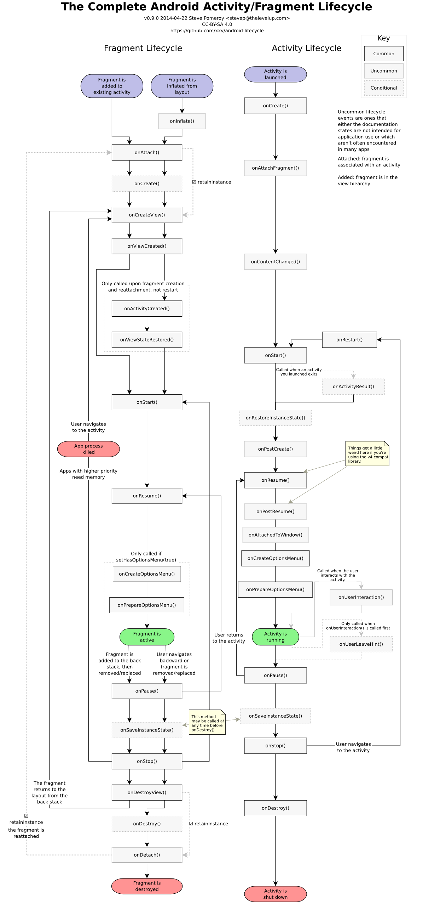

title: Android Activity生命周期和启动模式
date: 2018-04-01
tag: activity, android


##### `Activity` 的生命周期

一般 `Activity` 生命周期为 `onCreate()` -> `onStart()` -> `onResume()` -> `onPause()` -> `onStop()` -> `onDestroy()`

官方的生命周期图:


需要注意的几个点:

1. 当一个 `Activity` **A** 启动加一个 `Activity` **B** 时, 只有 **A** 的 `onPause` 执行完返回时, **B** 才开始执行`onCreate` `onStart`, 直到 `onResume`显示在前台, **A** 会执行 `onStop` `onDestroy`, 所以在 `onPause`不能执行太**耗时**的操作, 以便让另一个 `Activity` 快点显示到前台
2. `Activity` 会在应用发生变更时(常见的屏幕旋转, 输入框显示/隐藏, 屏幕大小变化[**SDK13之后**]),  还有在 `onPause()` `onStop()` 中被系统收回内存, 如上图左边. 此时也会重建 `onCreate()`. 
   可以在 `Manifest.xml`中设置`androi:configChanges="`来表示发生行为变更时不重建. 
   常见的设置有:
   `orientation`表示屏幕旋转
   `keyboardHidden`表示键盘显示/隐藏
   `screenSize`表示屏幕大小发生变化(**SDK13**以上的要加上这个才有效)
   `locale`表示本地位置发生了改变
3. 如果使用 `onSaveInstanceState(Bundle)` 保存了一些数据, 便可以在 `onCreate(Bundle)` 和 `onRestoreInstanceState(Bundle)`中获得到这些数据, 惟一的区别是, 如果没有调用 `onSaveInstanceState(Bundle)` 的话, `onCreate(Bundle)` 中为 `null`, 并且 `onRestoreInstanceState(Bundle)` 不会被调用; 一但`onRestoreInstanceState(Bundle)` 被调用,  其参数一定不为 `null`, 并且`onSaveInstanceState()`调用的时机只能确定一定在`onDestory()`前被调用, 但是不确定是在`onStop()`之前或之后; 官方推荐在 `onRestoreInstanceState(Bundle)`中操作数据. 
   如果设置了发生行为变更时不重建`Activity`, 则只会调用`onConfigurationChanged()`方法, 而不会调用`onSaveInstanceState()`和`onRestoreInstanceState()`


上图只是一般的`Activity`生命周期, 而一但加入`Fragment`, 情况会变得更加的复杂

完整的`Fragment`和`Activity`生命周期图




##### `Activity`的启动模式

`Activity`一共有四种启动模式. 应用程序都会有一个默认的**任务栈**, 其名字默认为**包名**, 任务栈采取**后进先出LIFO**, 可能通过设置`Manifest.xml`中`Activity`的`android:taskAffinity="包名.task_name"`来指定任务栈. `Activity`启动模式可以在`xml`中配置, 也可以在`java`代码中启动时设置(**除`singleInstance`外**), 运行时在`java`中指定优先级高于配置文件中的.

1. `standard`默认的标准模式

   默认的`Activity`启动时的模式, 无论是否有这个实例, 都会新生成一个实例压入栈中. 在这个模式中,假如使用 **B** 启动了 **A**(为`standard`模式), **A** 是进入到 **B** 的**任务栈**吕. 所以当我们使用`ApplicationContext`启动一个`Activity`时会发生`RuntimeException`:**Calling startActivity from outside of an activity context require the `FLAG_ACTIVITY_NEW_TASK` flag**, 表明`ApplicationContext`是没有任务栈的, 要想从`ApplicationContext`启动一个`Activity`需要为其设置一个新的任务栈标志`FLAG_ACTIVITY_NEW_TASK`. 但这是一个很不好的编程行为, 不推荐

2. `singleTop`栈顶复用模式
   该模式主要是指`Activity`如果已经处于**栈顶**, 便不会再次新创建新的`Activity`入栈. 此时不会调用`onCreate()`方法而是调用`onNewIntent()`方法. 需要注意的是, 新的`Activity`的任务栈名称. 比如在任务栈 A 中是栈顶, 而在 B 不是, 此时要入的栈是 B, 那么还是要新创建再入栈. 

3. `singelTask`栈内复用模式

   指的是如果要入栈的里头已经有了该`Activity`的实例, 则不会新创建实例. 而是把`Activty`"上头"的其他`Activity`出栈, 使其位于栈顶. 所以这个模式自带一个**`clearTop`**光环(标志位`FLAG_ACTIVITY_CLEAR_TOP`)`, 清除"头顶"的`Activity`.当不创建新的实例时, 也是调用其`onNewIntent()`方法
   需要注意的是, `singleTask`也**受到其配置的任务栈名称限制**, 并不是创建了新的实例时就一定会创建新的任务栈. 要看配置以及任务是否已经存在. 这是一个容易搞混的地方.

4. `singleInstance`单实例模式
   一种加强版的`singleTask`模式. 也自带`clearTop`. 在配置文件中设置, 自己在一个任务栈中, 调用时时只用生成一次实例, 之后会复用这个实例. 

> 当`taskInffinity`和`allowTaskReparentint`结合使用时, `Activity`会任务栈中跳转走.
>
> 比如, 应用 `A`调用应用`B`的`Activity C`, 此时返回桌面, 点`B`启动时, 会进入`C`而不是默认的主界面, 相当`A`中任务栈里的`C`并"拿到"了`B`里面


##### `Intent`的过滤规则

`intent-filter`需要匹配`action`, `category`, `data`三个项目. 可以混搭写, 同时匹配多个不同的. 还可以同时有多个`intent-filter`

```xml
<intent-filter>
    <action android:name="android.intent.action.SEND"/>
    <action android:name="android.intent.action.SEND_MULTIPLE"/>
	<category android:name="android.intent.category.DEFAULT"/>
    <data android:mimeType="application/vnd.google.panorama360+jpg"/>
    <data android:mimeType="image/*"/>
</intent-filter>
```

1. `action`的匹配区分大小写, 可以有多个`action`, 匹配`Intent`时只要有一个能匹配即可
2. `category`的匹配规则时, 如果写的`Intent`中出现的`category`, 那么每一个`category`都要在过滤规则`intent-filter`中有相应的匹配. `Intent`中也可以没有`category`这样系统会为其添加一个`android.intent.category.DEFAULT`的`category`
3. `data`的匹配规则: 只要有一条能匹配上即可

`data`的语法:

```xml
<data
      android:scheme="string"
      android:host="string"
      andorid:port="string"
      android:path="string"
      android:pathPattern="string"
      android:pathPrefix="string"
      andorid:mimeType="string"/>

<scheme>://<host>:<port>/[<path>|<pathPrefix>|<pathPattern>]
context://info.ivicel.github.hello_android/table1
```

> 要在`java`代码中设置`Intent`的`Data`时要使用`setDataAndType()`, 不能使用`setData()`再`setType()`, 因为这两个方法会彼此清除对方的值
>
> <scheme>的值只能是`file://`或者`content://`开头
>
> 启动器的过滤器为:
>
> `<action android:name="android.intent.action.MAIN"/>`
>
> `<category android:name="android.intent.category.LAUNCHER"/>`


#### Reference:

1. Android 开发艺术探索
2. https://developer.android.com/reference/android/app/Activity.html