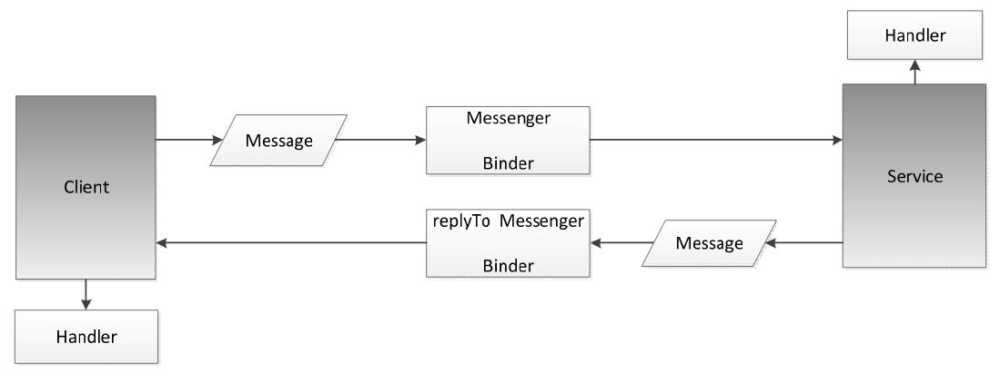

title: Android IPC机制
date: 2018-04-01
tags: IPC, Android, 进程间通信


#### 1. 开启多进程的方法

Android 应用启动时会自动创建一个新的进程, 其进程名默认为**包名**, 为四大组件(**Activity** , **Service**, **ContentProvider**, **BroadcastReceiver**)启动一个新的进程, 最简单的是在`Manifest.xml`中为其配置`android:process`进程名称. 有两种写法. 

一是指定进程的全称:`android:process="info.ivicel.github.android_ipc.another_process"`, 此时进程为一个全局进程, 其他应用可以通过`ShareUID`方式和它跑在同一进程中

二是简写: `android:process=":remote"`. 这种写法其完整的进程名为`包名:remote`, 并且此时进程为一个私有进程, 其他应用的组件不可以同时跑在该进程中

> 由于 Android 中为不同进程单独分配一个虚拟机来运行, 所以 Android 中不能通过**共享内存**来进行通信. 

在 Android 中使用**共享内存**, 便会造成:

1. 静态成员和单例模式完全失效
2. 线程的同步机制完全失效, 通过共享内存来`synchronized`, 锁对象/锁全局类都不是同一个了
3. `SharedPreferences`的可靠性下降. 这是因为`SharedPreferences`底层是通过`xml`文件的来实现的, 需要对文件的读写进行同步
4. `Application`会多次创建. 多进程会为每一个进程启动一`Application`, 相当多次启动应用. 可以在`Application`的`onCreate()`里打印出进程`id`证实启动了多次应用


#### 2. Android 中 IPC 的几种方式

在 Android 中的 IPC 大致有以下几种: 

* 通过`Intent`的附加`extras`来传递, 其本质是通过`Bundle`来实现的
* 通过共享文件
* 通过`Binder`, 其底层是通过`AIDL`来实现
* 通过`ContentProvider`
* 通过网络`Socket`
* 直接使用`AIDL`
* 通过`Messenger`, 注意这不是消息载体`Message`


1. ##### 使用 Bundle

   `Bundle`的使用很是简单, 其实现了`Pacelable`接口, 可以直接传递各种可序列化的数据. 

   这种方式虽然简单易用, 但如果需要传输的数据不支持`Bundle`, 那只能通过其他绕路方式. 比如需要在 A 进程中计算出某个结果, 然后启动进程 B, 同时把结果传给 B. 但计算结果不支持传输. 可以启动一个 B 进程里的后台 Service, 在其中计算出结果, 再传到前台 B 进程了. Service 和 B 是同一个进程.

   ​

2. ##### 使用共享文件

   可以在进程`A`中写入文件, 在进程`B`中读出文件内容, 要注意的是读出的对象和写入时的对象其内容数据虽然一样, 但本质上是两个对象. 并且使用共享文件进行通信时, 如果要求的并发量过高, 其同步就越困难, 有可能出并发读/写时数据不一致的情况. 其适合使用在对数据同步要求不高的进程之间的通信.
   `SharedPreferences`其底层的实现也是一个`.xml`文件, 但是系统对其读/写时, 会维护一个在内存里的缓存, 这使得多进程模式下对`SharedPreferences`的读写非常不可靠. 所以不要使用其行 IPC

   ​

3. ##### 使用 AIDL 通信

   见 [在Android中使用AIDL进行IPC](./zai-androidzhong-shi-yong-aidljin-xing-ipc.html)

   ​

4. ##### 使用 Messenger

   `Messenger` 是对 AIDL 的封装, 使用起来更加的方便. 服务端每一次只处理一个请求, 使用的 `MessageQueue` 队列, 这样在服务端可以不用考虑并发的问题.

   ###### 4.1 服务端

   由于是对 AIDL 的封装, 所以服务端也是创建一个 Service, 创建一个 Messenger 对象和一个 Handler 对象,

   Handler 处理客户端发送过来的数据. Service 的 Binder 对象可由 Messenger 对象返回.

   ###### 4.2 客户端

   客户端通过 `bindService()` 拿到服务端的代理. 通信的数据由 `Message` 类来封装. 这个代理对象传送数据的方向为 client -> server, 只能单向传输.

   如果客户端需要服务器传回数据, 只能在客户端创建一个 `Messenger` 对象和 `Handler` 对象, 并通过`Message.replyTo` 将这个对象传给服务器. 这样 server -> client 就可以传送数据了.

   > `Messenger` 类是 `final` 的, 不可能通过继承 `Messenger` 来重写传送数据方式

   


```java
// server 
public MessengerService extends Service {
    private static final String TAG = "MessengerService";
    
    static class MessengerHandler extends Handler {
     	@Override
        public void handleMessage(Message msg) {
         	switch (msg.what) {
                case Constants.MSG_HELLO_FROM_CLIENT:
                    Log.d(TAG, "Hello from client: " + 
                          msg.getData().getString("msg"));
                    break;
                    
                default:
                    super.handleMessage(msg);
            }
        }
    }
    
 	private Messenger mMessenger = new Messenger(new MessengerHandler());   
    
    
    @Override
    public IBinder onBind(Intent intent) {
     	return mMessenger.getBinder();   
    }
}


// client
public MessengerActivity extends AppCompatActivity {
 	private staitc final String TAG = "MessengerActivity";
    
    private Messenger mMessenger;
    
    private SerivceConnection connection = new ServiceConnection() {
     	@Override
        public void onServiceConnected(ComponentName name, IBinder service) {
         	mMessenger = new Messenger(service);
            sendHelloToServer();
        }
        
        @Override
        public void onServiceDisconnected(ComponentName name) {}
    }
    
    @Override
    protected void onCreate(Bundle savedInstanceState) {
        super.onCreate(savedInstanceState);
        setContentView(R.layout.activity_main);
        
        Intent intent = new Intent(this, MessengerService.class);
        bindService(intent, connection, Context.BIND_AUTO_CREATE);
    }
    
    private void sendHelloToServer() {
     	Message msg = Message.obtain(null, Constants.MSG_HELLO_FROM_CLIENT);
        Bundle data = new Bundle();
        data.putString("msg", "this is hello from client.");
        msg.setData(data);
        try {
        	mMessenger.send(msg);
        } catch (RemoteException e) {
         	e.printStackTrace();   
        }
    }
    
    @Override
    protected void onDestroy() {
		super.onDestroy();
        unbindService(connection);
    }
}
```

在 <<Android开发艺术探索>> 中提到:

> Message中的另一个字段object在同一个进程中是很实用的，但是在进程间通信的时候，在Android 2.2以前object字段不支持跨进程传输，即便是2.2以后，也仅仅是**系统**提供的实现了Parcelable接口的对象才能通过它来传输。这就意味着我们自定义的Parcelable对象是无法通过object字段来传输的

测试例子: [GitHub](https://github.com/ivicel/dev-android-samples/tree/master/ipc-with-messenger)

测试环境: 

* Android Studio 3.1
* Gradle 4.4
* android gradle tool 3.1
* target sdk 27
* Build tool 27.0.2

`MessengerService` 使用设置 `android:process=":remote"` 单独一个进程后, 会发生 `java.lang.ClassNotFoundException`, 猜测是因为找到不 `ClassLoader`


#### Reference:

1. <<Android开发艺术探索>>