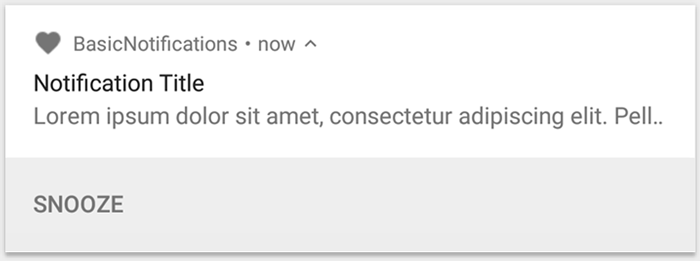
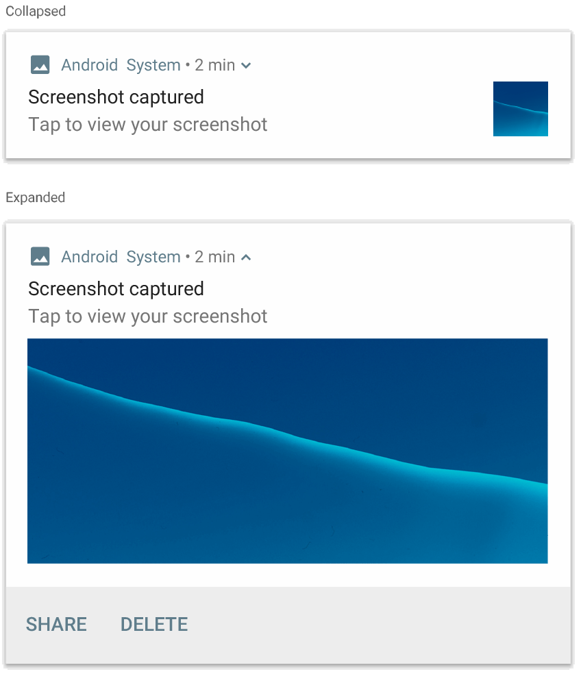
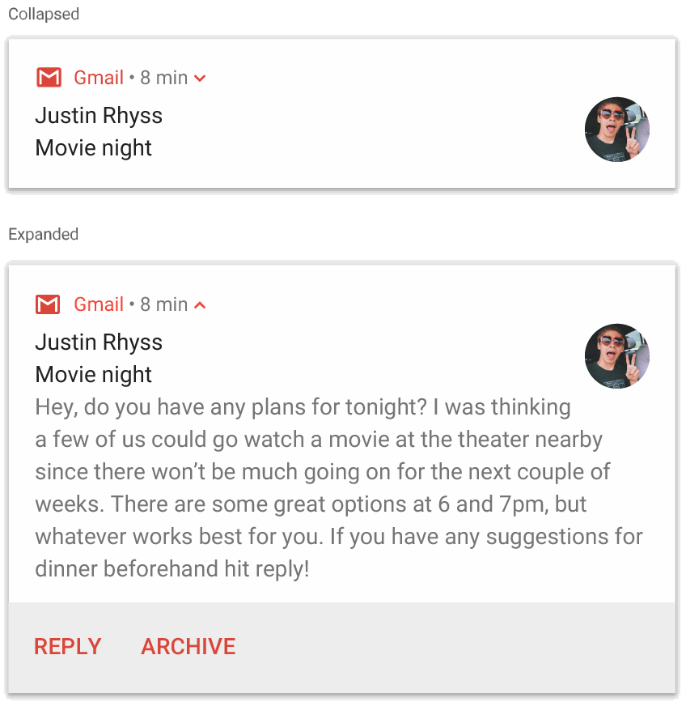
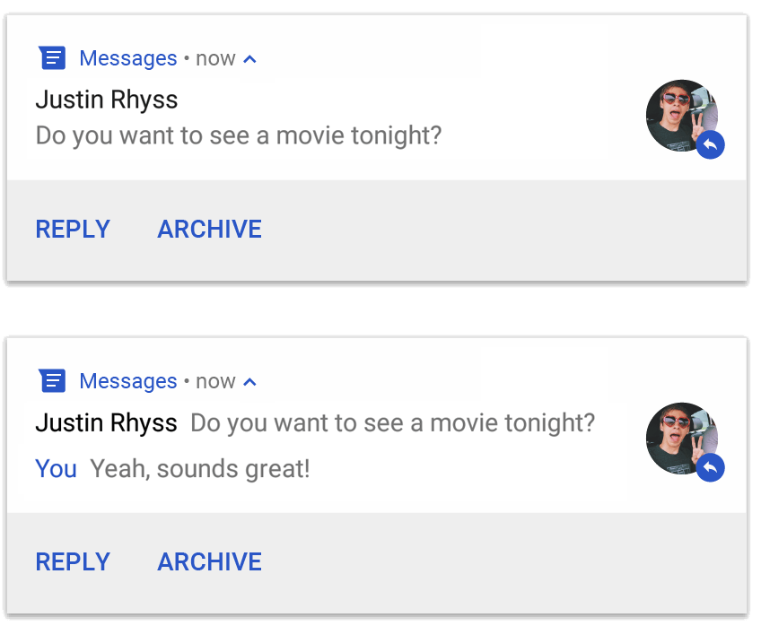
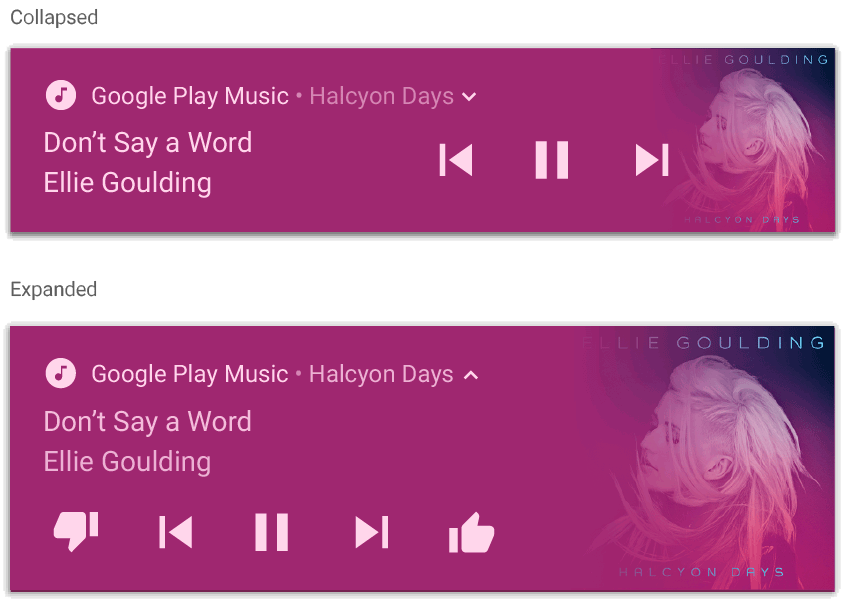
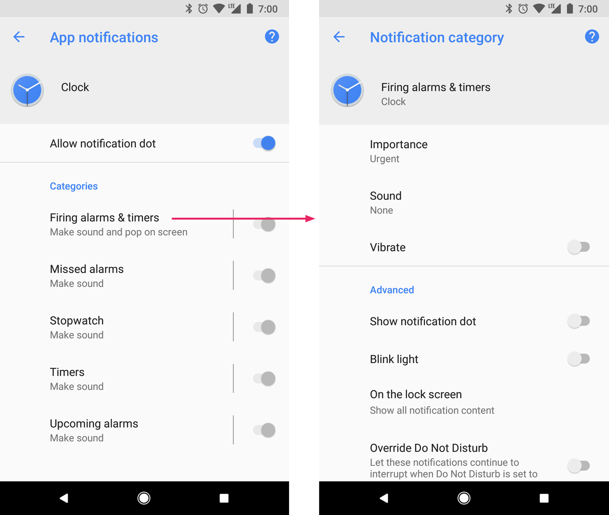
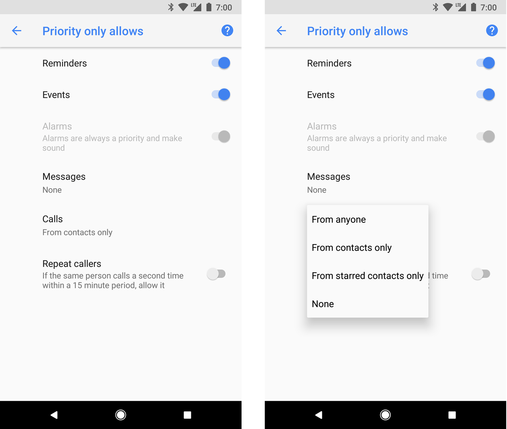

title: Android 通知
date: 2018-05-02
tags: 通知, notification

[TOC]

### 1. 简介

#### 1.1 通知可出现的地方

1. 以一个图标出现在 status bar 中, 一般是一个单 alpha 通道的图标, 但有些魔改的系统是可以显示多色图标的

2. notification drawer 模式, 也就是下拉状态栏

3. heads-up notification 模式, 在 Android 5.0(SDK 21) 之后, 如果当前 app 全屏显示, 手机处于解锁状态, 然后通知拥有高优先级(high priority, Android 7.1, SDK 25)并产生铃音/震动, 或通知的 channel 拥有重要重级(high  importance, Android 8.0, SDK 26)的话, 就会弹出一个浮动的通知窗口

4. 锁屏状态中. 在 Android 5.0(SDK 21) 之后, 通知可以出现在 lock screen 中. 在 app 中可以单独设置通知的私密性,  用户也可以设置全局系统通知私密性, 这会覆盖 app 的设置

5. 在 Android 8.0(SDK 26) 之后, 如果 launcher 支持了未读通知的 badge, 当长按该 app 时会弹出一个通知, 可以像 notification drawer 左右滑掉或者点击, 即使 app 没有支持长按 shortcuts 也是可以弹出的通知的


#### 1.2 通知基础结构


1. Small icon: 通过 `setSmallIcon()` 来设置, 一般为 app 图标, 这个必须设置
2. App name: 系统自动设置
3. Time stamp: 通知产生的时间, 可以通过 `setWhen()` 来设置或使用 `setShowWhen(false)` 来隐藏, 默认是当前系统时间. 
4. Large icon: 可选, 右边缩略图(Thumbnail), 通过 `setLargeIcon()` 来设置
5. Title: 可选, 通知的标题, 通过 `setContentTitle()` 来设置
6. Text: 可选, 通知的内容, 单行显示, 超出部分会显示成 `…`, 通过 `setContentText()` 来设置

#### 1.3 通知的兼容性

由于通知在每个版本中都有不同的改动, 所以我们总是使用 v4 support library 里的兼容版本 `NotificationCompat` 和 `NotificationManagerCompat`, 这样我们可以更少写些 API 版本测试条件语句.下面是一些变更总结

##### Andorid 4.1, API level 16

* 增加了可扩展的通知, 即是 notification style. `BigTextStyle`, `BigPictureStyle`, `InboxStyle`
* 可设置通知多个点击按钮
* 可单独关闭某个 app 的通知

##### Andorid 4.4, API level 19

* 增加了通知监听服务 api, notification listener service
* 支持 Wear OS(API 20)

##### Andorid 5.0, API level 21

* 增加了锁屏通知(通过 `setVisibility()` 来设置)和 heads-up 模式
* 增加了 Do Not Disturb 防打扰模式
* 可以通过 `setPriority()` 来设置通知的等级, 这会影响通知在不同模式下的弹出状况
* 增加了通知的分组功能 `setGroup()`, 这样不会导致同一个 app 在很短时间内收到多条信息时弹出一排的通知
* 增加了新的 `MediaStyle`, 音乐后台播放时的通知

##### Andorid 7.0, API level 24

* 重新设计了通知模版, 重点突出了 hero image 和 avatar
* 增加了新的 style: `MessagingStyle` 像短信息一样的排列, `DecoratedCustomViewStyle`, `DecoratedMediaCustomViewStyle` 自定义的 view, 但依旧由系统进行装饰
* 现在可以使用和 Wear OS 一样的通知分组功能, API 是一样的
* 增加了在通知里直接回复消息的功能, 只能单行, 不能分段

##### Andorid 8.0, API level 26

* 增加了通知 channel, 在 app 中要注册 channel, 每个通知都必须放到 channel 中. 

> 1. Target SDK < 26, 会按 target sdk 来运行
> 2. Target SDK >= 26, 如果运行在 Android 8.0 及以上时, 必须有设置 channel, 否则会打印出 error log. 非 Android 8.0 则按以前的通知行为

* 用户可以对不同 channel 进行关闭, 打开等操作, 代替了以前只能关闭整个 app 的通知
* 现在可以在 launcher 中 app 图标上显示有未读通知了, 需要这个 launcher 支持
* 可以在下拉栏中滑动通知来设置**稍后提醒(snooze)**
* 可以设置通知了背景颜色了
* 一些 APIs 从 Notification 移到了 NoitficationChannel 中, 比如设置通知的等级 `NotificationCompat.Builder.setPriority()`. 如果 target sdk == 21 并且在 8.0 的机器上运行, `NotificationCompat.Builder.setPriority()` 会被忽略, 只使用 `NotificationChannel.setImportance()`

> 在 Andorid 8.1, API level 27 之后, 在同一秒内 app 只能发出一次通知铃音. 并且如果在短时间内(一般少于 1 秒)发生多次通知, 系统可能会丢弃其中的一些通知


### 2. 创建通知及通知行为(Notification actions)

#### 2.1 基本通知的创建

以 target sdk 26 来创建新的通知

```java
public static final String CHANNEL_ID = "my_channel_id";
NotificationCompat.Builder builder = new NotificationCompat.Builder(
    	context, CHANNEL_ID)
    	.setSmallIcon(R.drawable.notification_icon)
    	.setContentTitle(textTitle)
    	.setContentText(textContent)
    	// 为兼容 8.0 以下系统的优先级
    	.setPriority(NotificationCompat.PRIORITY_DEFAULT);	

// 兼容 8.0 系统的 channel 设置
if (Build.VERSION.SDK_INT >= Build.VERSION_CODES.O) {
    // 传入 channel id, channel name, 和优先级, 运行在 8.0 及以上时会忽略 setPriority
	NotificationChannel channel = new NotificationChannel(CHANNEL_ID, channelName,
			NotificationManager.IMPORTANCE_DEFAULT);
    channel.setDescription(description);
    // 向系统注册这个 channel
    NotificationManager manager = (Notification) context.getSystemService(
        	Context.NOTIFICATION_SERVICE);
    manager.createNotificationChannel(channel);
}
```

在创建完通知后, 可以通过 `NotificationManagerCompat.notify()` 来显示通知.

```java
NotificationMangerCompat notificationManger = NotificationMangerCompat.from(context);
notificationManger.notify(notificationId, builder.build());
```

`notificationId` 是一个重要的参数, 之后我们通 `cancel(notificationId)` 来取消特定通知, 或者 `cancelAll()` 取消所有通知. 

对同一个 `notificationId` 进行调用 `NotificationManagerCompat.notify()` 便会更新通知

#### 2.2 通知的点击行为(tap action)

在下拉通知中, 通过点击通知可以跳转到通过的来源处, 通过 `setContentIntent(PendingIntent)` 来实现. PendingIntent 可以启动 activity, service, 发送 broadCast. 

```java
// 启动一个 activity
Intent intent = new Intent(context, SourceActivity.class);
// 设置一个新栈来跳转, 这样不会影响当前任务栈里的 activity
intent.setFlags(Intent.FLAG_ACTIVITY_NEW_TASK | Intent.FLAG_ACTIVITY_CLEAR_TASK);
PendingIntent pi = PendingIntent.getActivity(context, 0, intent, 0);

builder.setContentIntent(pi)
    	// 设置点击后关闭通知
    	.setAutoCancel(true);
```

#### 2.3 通知的 action button

在 Android 4.1 之后, 通知可设置如下图的 action button, 通过 `addAction()` 来设置



比如点击后, 产生一个广播的代码如下. 可以添加多个 action button

```java
Intent snoozeIntent = new Intent(context, MyBroadCastReceiver.class);
snoozeIntent.setAction(ACTION_SNOOZE);
snoozeIntent.putExtra(EXTRA_NOTIFICATION_ID, 0);
PendingIntent pi = PendingIntent.getBroadcast(context, 0, snoozeIntent, 0);
// 向通知添加 action button 事件
builder.addAction(R.drawable.ic_snooze, snoozeString, pi);
```

#### 2.4 direct reply 直接回复按钮

在 Android 7.0, API level 24 之后添加可以直接在通知栏回复消息的按钮. 点击前和点击后的样式如下图

```java
private static final String KEY_TEXT_REPLY = "key_text_reply";

if (Build.VERSION.SDK_INT >= Build.VERSION_CODES.N) {
    // 1. 创建一个 RemoteInput. 传入的 key 值会在发送的 intent 中用来获得消息体
	RemoteInput remoteInput = new RemoteInput.Builder(KEY_TEXT_REPLY)
        	.setLabel(replyLabel)
        	.build();
    
    // 2. 创建一个 PendingIntent 用来产生点击行为
    PendingIntent replyPendingIntent = PendingIntent.getBroadcast(context,
			conversationRequestCode, intent, PendingIntent.FLAG_UPDATE_CURRENT);
    
    // 3. 使用 addRemoteIput 将 RemoteInput 添加一通知中
    NotificationCompat.Action action = new NotificationCompat.Action.Builder(
        	R.drawabl.ic_reply_action, labelString, replyPendingIntent)
        	.addRemoteInput(remoteInput)
        	.build();
    
    // 4. 创建并发出通知
    Notification notification = new NotificationCompat.Builder(context, CHANNEL_ID)
        	.setSmallIcon(R.drawable.notification_icon)
        	.setContentTitle(title)
        	.setContentText(text)
        	.addAction(action)
        	.build();
    
    NotificationManagerCompat.from(context).notify(id, notification);
}
```

通过 `RemoteInput.getResultsFromIntent()` 在 BroadCastReceiver 中获得传过来的 intent 里的消息

```java
// intent 便是传入 broadcast 里的 intent, 使用原先传入的 key 值
private CharSequence getMessageText(Intent intent) {
    Bundle remoteInput = RemoteInput.getResultsFromIntent(intent);
    if (remoteInput != null) {
     	return remoteInput.getCharSequence(KEY_TEXT_REPLY);   
    }
    
    return null;
}
```

在用户使用直接回复之后, 我们还要关闭这个通知, 显示已回复等

```java
Notification repliedNotification = new NotificationCompat.Builder(context, CHANNEL_ID)
    	.setSmallIcon(R.drawable.message_replied)
    	.setContentText(repliedString)
    	.build();
// 使用上一个通知的 id, 以便覆盖掉上个通知
notificationManager.notify(id, repliedNotification);
```

#### 2.5 通知栏进度条

通过 `NotificationCompat.Builder.setProgress(max, progress, false)` 不断更改当前进度 `progress`, 最大值 `max` 一般设置为 100 之类. 

当完成之后, 通过设置 `max` 为 0 来隐藏进度条, `Notification.Builder.setProgree(0, 0, false)`

> 最后个参数影响进度条是显示确定的百分比样式, 还是显示一个不断滚动的样式

#### 2.6 锁屏通知策略

我们可以通过 `NotificationManger.Builder.setVisibilty()` 方法来设置通知在锁屏时的显示策略. 

* `NotificationCompat.VISIBILITY_PUBLIC`: 显示通知所有内容
* `NotificationCompat.VISIBILITY_SECRET`: 不显示任何通知内容
* `NotificationCompat.VISIBILITY_PRIVATE`: 显示通知的基础信息, 比如 app 名, 通知标题, 或者像 "你有 3 条新的消息" 之类, 这个消息是可以自定义的, 通过 `setPublicVersion()` 方法来设置

> 编码时虽然可以设置锁屏通知策略, 但最终会受到用户的系统设置的影响, 被其覆盖掉

#### 2.7 Notification badge

在 Android 8.0, API 26 之后, 可以在 launcher app 图标右上角显示有通知, 需要 launcher 支持 shortcuts. 通知点是系统自动加入的, 如果不需要显示可以使用 `setBadge(false)` 来取消显示. 

长按 app 弹出通知时, 系统会自动计算当前 app 共有几条通知, 数量显示在弹出的窗口右上角, 可以通过 `setNumber()` 来手动设置自己需要的数字.

弹出的窗口默认使用的是 large icon, 可以通过 `setBadgeIconType(BADGE_ICON_SMALL)` 来更改使用 small icon.

使用 `setShortcutId()` 来在弹出通知窗口时, 隐藏 shortcut


### 3. 可扩展的通知(Expandable notification)

基础的通知是只包含一个标题, 一行文字, 一个或多个操作. 系统内置了一些可扩展开来的通知, 可以通过 `setStyle()` 来设置

#### 3.1 BigPictureStyle 大图模式

大图模式常见的是截图时的样式



```java
Notification noti = new NotificationCompat.Builder(context, CHANNEL_ID)
		.setSmallIcon(R.drawable.new_post)
	    .setLargeIcon(myBitmap)
    	.setStyle(new NotificationCompat.BigPictureStyle()
				.setBigPicture(myBitmap)
		        .bigLargeIcon(null))		// 下拉时, 把右边的缩略图设置为 null
    .build();
```

#### 3.2 BigTextStyle 多文本模式



```java
builder.setStyle(new NotificationCompat.BigTextStyle()
        // 设置长文本, 文本换自动换行, 单行的原本还是使用 setContentText 
		.bigText(textString))
    	.build();
```

#### 3.3 InboxStyle

这个模式相当于可以设置多个单行, 超出的文本不会自己换行而是使用 `…` 来代替

```java
builder.setStyle(new NotificationCompat.InboxStyle()
		.addLine(str1)
		.addLine(str2)
        .addLine(str3))
    .build();
```

#### 3.4 MessagingStyle

像信息 app 一样能设置对话形式的样式

```java
Notification notification = new NotificationCompat.Builder(context, CHANNEL_ID)
		.setSmallIcon(R.drawable.new_message)     
    	.setLargeIcon(aBitmap)
     	.setStyle(new Notification.MessagingStyle(
            	resources.getString(R.string.reply_name))
         		.addMessage(text1, time1, sender1)
         		.addMessage(text2, time2, sender2))
     	.build();
```

#### 3.5 MediaStyle

MediaStyle 有两个兼容包, `android.support.v4.media.app.NotificationCompat.MediaStyle` 和 `android.support.v7.app.NotificationCompat.MediaStyle`. 

v7 的包是继承了 v4 包的类, 在 API level 26 以上, v7 包类已经弃用, 如果使用 v4 包, 还需要向 build.gradle 中添加 `com.andorid.support:support-media-compat:27.1.1` 支持库. 

MediaStyle 一般用于音乐播放器, 其界面类似下图



MediaStyle 扩展界面最多可以添加 5 个按钮, 按钮的顺序从左到右为添加的顺序. 非扩展界面最多可以显示 3 个按钮. 显示的按从扩展界面添加的顺序中选出序号(0-4). 

> 如果只添加了 4 个按钮, 却在非扩展里选择超出的下标值, 比如 4 则 app crash

```java
builder = new NotificationCompat.Builder(this, CHANNEL_ID)
        .setSmallIcon(R.mipmap.ic_launcher_round)
        .setLargeIcon(bitmap)
        .setContentTitle("Song's name")
        .setContentText("Singer's name")
    	// 按钮的显示按添加的顺序从左向右排列
        .addAction(new NotificationCompat.Action(
            	R.drawable.ic_thumb_down, "Down", actionPendingIntent))
        .addAction(new NotificationCompat.Action(
            	R.drawable.ic_play_previous, "Previous", actionPendingIntent))
        .addAction(new NotificationCompat.Action(
            	R.drawable.ic_pause, "Pause", actionPendingIntent))
        .addAction(new NotificationCompat.Action(
            	R.drawable.ic_play_next, "Next", actionPendingIntent))
        .addAction(new NotificationCompat.Action(
            	R.drawable.ic_thumb_up, "Up", actionPendingIntent))
        .setStyle(new android.support.v4.media.app.NotificationCompat.MediaStyle()
        // 设置非扩展界面显示的按钮, 参数为一个整型下标数组
        .setShowActionsInCompactView(1, 2, 3));
```


#### 4. 通知分组

在 Android 7.0, API 24 之后, 可以对通知按 app 来分组. 如果使用分组策略, 在低于 Android 7.0 的系统会忽略这个功能, 还是一条一条的发出来. 在 7.0 以上, 系统也会自动把一个 app 的 4 个及以上的通知归为一个组


分组的使用方法是, 对想要分组的通知使用 `setGroup(key)` 来设置一个 group key, 拥有同一个 group key 的通知会被分到同一个组(这个通知要注意使用不同的 id, 因为这些通知都是独立的). 发送出这个通知后, 我们还要发送一个整理-归类通知, 告诉系统, 把上一个通知分到组里面, 而不是作为一个普通的通知显示出来. 

```java
String GROUP_KEY_WORK_EMAIL = "com.android.example.WORK_EMAIL";
// 发送普通的通知
final Notification notification = new NotificationCompat.Builder(this, CHANNEL_ID)
        .setSmallIcon(R.mipmap.ic_launcher_round)
        .setContentText(text)
        .setContentTitle(title)
        .setAutoCancel(true)
        .setGroup(GROUP_KEY_WORK_EMAIL)
        .build();
        
mNotificationManager.notify(getNewNotificationId(), notification);

// 当超过两个通知时, 发送一个合并分组通知
final Notification summaryNotification = new NotificationCompat.Builder(this, 
			CHANNEL_ID)
    	.setSmallIcon(R.drawable.ic_notify_summary_status)
    	.setStyle(new NotificationCompat.InboStyle()
                  .setBigContentTitle(bigContentTitle)
                  .setSummaryText(summaryText))
    	.setGroup(GROUP_KEY_WORK_EMAIL)
    	.setGroupSummary(true);
		.build();
```


### 5. Notification Channel

在 Android 8.0, API 26 之后, 增加了通知 channel, 把通知都放在 channel 中, 这样可以单独对 channel 进行设置, 而不用对全局的 app 通知进行设置, 有分类性, 针对性更强. 比如邮件 app 中, 可以关闭该 app 的有新邮件通知, 但可另外设置一个 channel, 在这 channel 中的邮件通知还依然显示.

如果 `targetSdkVersion` 为 26 及以上, 那么当运行在 8.0 及以上时系统时, 必须要设置 channel, 否则通知将不能显示, 并将打印出错误 log(可以在开发者选项中设置显示通知 channel 警告, 会弹出一个 toast)

如果 `targetSdkVersion` 为 25 及以下, 那么无论运行在哪个系统上, 行为将和 Android 7.1 及以下版本一样



#### 5.1 创建 channel 的步骤:

1. 由于 `NotificationChannel` 类没有兼容版本, 只 API 26 及以上存在, 所以需要对 `SDK_INT` 进行版本检查.
2. 创建一个 `NotificationChannel` 对象, 传入一个惟一的 channel id, 一个用户可见的 channel name, 和该 channel 的 importance 等级
3. 可额外设置 channel 的描述 `setDescription()`, 这样用户点开通知设置时可见
4. 使用 `NotificationManager#createNotificationChannel()` 方法注册该 channel

```java
private void createNotificationChannel() {
    // 兼容检查
 	if (Build.VERSION.SDK_INT >= Build.VERSION_CODES.O) {
    	NotificationChannenl channel = new NotificationChannel(CHANNEL_ID, 
				channelName, NotificationManager.IMPORTANCE_DEFAULT);
        channel.setDescription(channelDescription);
        NotificationManager manager = (NotificationManager) getSystemService(
            	Context.NOTIFICATION_SERVICE);
        manager.createNotificationChannel(channel);
    }
}
```

#### 5.2 用户通知 channel 设置

一但注册通知 channel 后, 我们在编码时只能更改 channel name 和 channel description, 而其他的设置只能交由用户自己设置更改. 为了能让用户自己作出更改, 需要为用户提供一个 settings ui, 通过 `Settings.ACTION_CHANNEL_NOTIFICATION_SETTINGS` . 下面是启动一个通知设置的示例

```java
Intent intent = new Intent(Settings.ACTIOIN_CHANNEL_NOTIFICATION_SETTINGS);
// 这两个值是必须要值的, 包名和通知 id
intent.putExtra(Settings.EXTRA_APP_PACKAGE, getPackageName());
intent.putExtra(Settings.EXTRA_CHANNEL_ID, myNotificationChannel.getId());
startActivity(intent);
```

#### 5.3 删除通知 channel

```java
private void deleteNotification(String notificationId) {
 	if (Build.VERSION.SDK_INT >= Build.VERSION_CODES.O) {
     	NotificationManager manger = (NotificationManager) getSystemService(
            	Context.NOTIFICATION_SERVICE);
        manager.deleteNotificationChannel(notificatioinId);
    }
}
```

#### 5.4 分组 channel

可以对 channel 进行不同的分组, 这个在多用户 app 上对不同的用户可以设置不同 channel 策略

```java
// 每一个分组都需要一个惟一的 group id
String groupId = "my_group_id";
// 用户可见的 group name
CharSequence groupName = getString(R.string.group_name);
NotificationManager manger = (NotificationManager) getSystemService(
		Context.NOTIFICATION_SERVICE);
manager.createNotificationChannelGroup(new NotificationChannelGroup(
    	groupId, groupName));
// 创建完 channel group 的后, 使用 setGroup 对 channel 进行分组
channel.setGroup(groupId);
```


### 6. 通知的重要性(Importance)和优先级(Priority)

在 Android 8.0 使用通知 channel 后, 通知的优先级 API 被移到了 `NotificationChannel` 中. 在低于 8.0 的系统里依旧使用 `setPriority()` 设置优先级, 而 8.0 及以上则忽略该设置, 使用 `NotificationChannel#setImportance()`

下表是 importance(`NotificationManager.IMPORTANCE_*`) 和 priority(`NotificationMangerCompat.PRIORITY_*`) 的对应设置

| 用户可见通知等级                                  | Importance(8.0 及以上) | Priority(7.1 及以下)                  |
| ------------------------------------------------- | ---------------------- | ------------------------------------- |
| **Urgent** (紧急通知)<br>响铃并弹出 heads-up 模式 | `IMPORTANCE_HIGHT`     | `RPIORITY_HIGH` 或 <br>`PRIORITY_MAX` |
| **High** (高)<br>响铃                             | `IMPORTANCE_DEFAULT`   | `PRIORITY_DEFAULT`                    |
| **Medium** (中)<br>不响铃                         | `IMPORTANCE_LOW`       | `PRIORITY_LOW`                        |
| **Low** (低)<br>不响铃且不会出现在通知栏          | `IMPORTANCE_MIN`       | `PRIORITY_MIN`                        |

> 通知的等级不会影响通知提示出现在非打断用户界面(non-inpterruptive system UI location), 比如 launcher 里 app 右上角的提示(badges/notification dots)


### 7. 2.7 系统内置的通知分类(system-wide category)和免打扰模式(Do Not Disturb mode)

Android 系统内置了一些预定义默认的通知分类, 比如 `CATEGORY_ALARM`, `CATEGORY_REMIDER`, `CATEGORY_EVENT` 等等, 使用 `NotificationCompat.Builder#setCategory()` 来为通知设定一个分类. 内置分类会影响在免打扰模式下的通知行为.

在 Android 5.0, API 21 之后增加了免打扰模式, 一共有 3 个等级

* 全部静音(Total silence): 阻止所有铃音, 震动, 包括闹钟, 音乐, 视频, 游戏等
* 闹钟除外(Alarms only): 除闹钟之外, 阻止所有铃音和震动
* 设置优先级除外(Priority only): 用户可以根据系统分类来设置不同的免打扰策略

在 Android 8.0, API 26 及以上, 用户可以通过设置 channel 的影响免打扰模式




### Reference

1. [https://developer.android.com/guide/topics/ui/notifiers/notifications](https://developer.android.com/guide/topics/ui/notifiers/notifications)
2. [https://juejin.im/entry/5925be652f301e006b3fd6a7](https://juejin.im/entry/5925be652f301e006b3fd6a7)