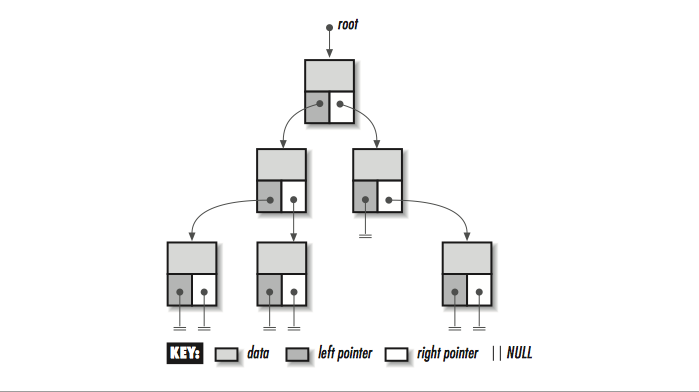
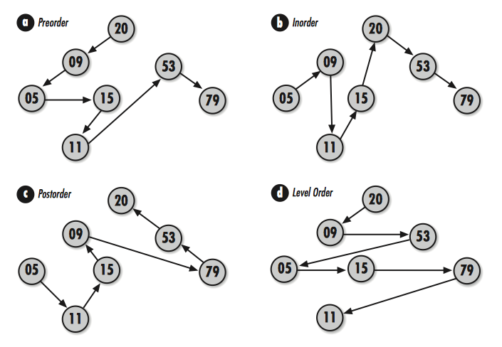
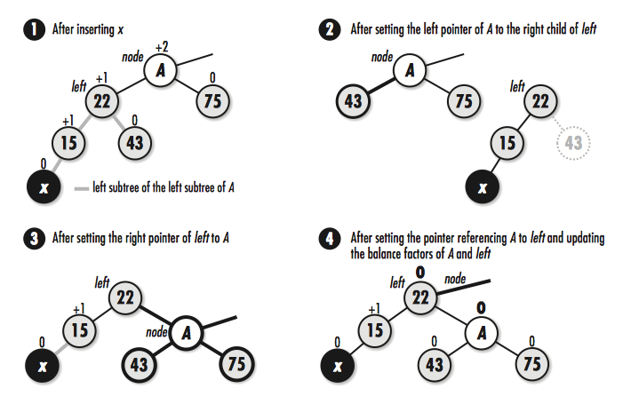
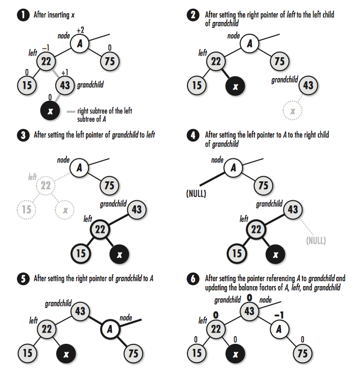
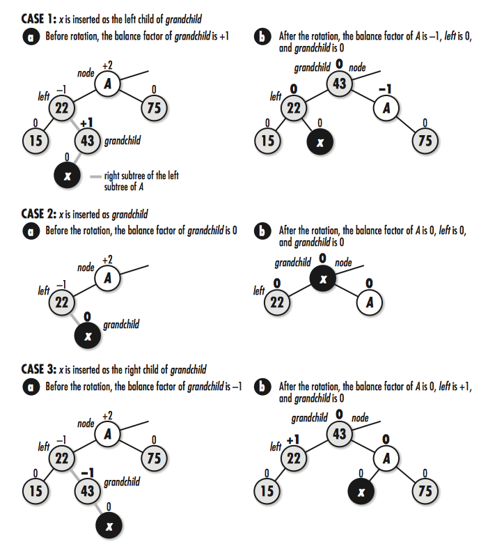

title: Matserting Algorithms with C-5: 树
date: 2017-03-27
tags: 算法, C, 集合, 数据结构

### 二叉树(Binary tree)



**先序遍历**: 根结点->左子结点->右子结点

**中序遍历**: 左子结点->根结点->右子结点

**后序遍历**: 左子结点->右子结点->根结占

**层级遍历**: 树根结点->下层左结点->该层右结点 (广度优先方法)



> 树的平衡是指在添加结点到下一层是必须保证本层的结点是满额的

二叉的接口定义

```c
/* 这里不没包含插入和删除非叶子结点的操作, 这些操作需要根据具体的应用将树中的其他结点做相应的调整 */
/* bitree.h */
#ifndef BITREE_H
#define BITREE_H
#include <stdlib.h>

/* 节点结构 */
typedef struct BiTreeNode_ {
    void *data;
    /* 左结点 */
    struct BiTreeNode_ *left;
    /* 右结点 */
    struct BiTreeNode_ *right;
}BiTreeNode;

/* 二叉树结构 */
typedef struct BiTree_ {
    int size;
    /* 为二叉搜索树使用, 比较两结点的大小, key1>key2 返回 1, 小于返回 -1, 相等返回 0 */
    int (*compare)(const void *key1, const void *key2);
    void (*destroy)(void *data);
    BiTreeNode *root;
}BiTree;
/* 初始化 */
void bitree_init(BiTree *tree, void (*destroy)(void *data));
/* 销毁 */
void bitree_destroy(BiTree *tree);
/* 插入左结点 */
void bitree_ins_left(BiTree *tree, BiTreeNode *node, const void *data);
/* 插入右结点 */
void bitree_ins_right(biTree *tree, BiTreeNode *node, const void *data);
/* 删除结点以及其下层全部的子结点, 并未实现只删除任意结点而不删除子结点 */
void bitree_rem_left(BiTree *tree, BiTreeNode *node);
void bitree_rem_right(biTree *tree, BiTreeNode *node);
/* 将两棵树合成新的二叉树, data 为根结点 */
int bitree_merge(BiTree *merge, BiTree *left, BiTree *right, const void *data);

#define bitree_size(tree) ((tree)->size)
#define bitree_root(tree) ((tree)->root)
#define bitree_is_eob(node) ((ndoe) == NULL)
#define bitree_is_leaf(node) ((node)->left == NULL && (node)->rigth == NULL)
#define bitree_data(node) ((node)->data)
#define bitree_left(node) ((node)->left)
#define bitree_right(node) ((ndoe)->right)

#endif
```

二叉树的实现 

```c
#include <stdlib.h>
#include <stdio.h>
#include "bitree.h"

void bitree_init(BiTree *tree, void (*destroy)(void *data))
{
    tree->size = 0;
    tree->destroy = destroy;
    tree->root = NULL;
}

void bitree_destroy(BiTree *tree)
{
    bitree_rem_left(tree, NULL);
    memset(tree, 0, sizeof(BiTree));
}

int bitree_ins_left(BiTree *tree, BiTreeNode *node, const void *data)
{
    BiTreeNode *new_node, **position;
    
    if (node == NULL) {
        if (bitree_size(tree) > 0) {
            return -1;
        }
        /* node 为 NULL 并且树为空时, 作根结点 */
        position = &tree->root;
    } else {
        if (bitree_left(node) != NULL) {
            /* 已有左结点 */
            return -1;
        }
        position = &node->left; 
    }
    /* 申请内存 */
    if ((new_node = (BiTreeNode *)malloc(sizeof(BiTreeNode))) == NULL) {
        return -1;
    }
    new_node->data = (void *)data;
    new_node->left = NULL;
    new_node->right = NULL;
    *position = new_node;
    tree->size++;
    return 0;
}

int bitree_ins_right(BiTree *tree, BiTreeNode *node, const void *data)
{
    BiTreeNode *new_node, **position;
    if (node == NULL) {
        if (bitree_size(tree) > 0) {
            return -1;
        }
        position = &tree->root;
    } else {
        if (bitree_right(node) != NULL) {
            return -1;
        }
        position = &node->right;
    }
    if ((new_node = (BiTreeNode *)malloc(sizeof(BiTreeNode))) == NULL) {
        return -1;
    }
    new_ndoe->data = (void *)data;
    new_node->left = NULL;
    new_node->right = NULL;
    *position = new_node;
    tree->size++;
    return 0;
}

void bitree_rem_left(BiTree *tree, BiTreeNode *node)
{
    BiTreeNode **position;

    if (bitree_size(tree) == 0) {
        return;
    }
    if (node == NULL) {
        /* 传入 NULL 删除根结点 */
        position = &tree->root;
    } else {
        position = &node->left;
    }

    /* 确定是否有左结点 */
    if (*position != NULL) {
        bitree_rem_left(tree, *position);
        bitree_rem_right(tree, *position);
        if (tree->destroy != NULL) {
            tree->destroy((*position)->data);
        }
        free(*position);
        *position = NULL;
        tree->size--;
    }
}

void bitree_rem_right(biTree *tree, BiTreeNode *node)
{
    BiTreeNode **position;
    /* 空树 */
    if (bitree_size(tree) == 0) {
        return;
    }
    /* 传入 NULL 删除根结点下右结点 */
    if (node == NULL) {
        position = &tree->root;
    } else {
        position = &node->right;
    }

    /* 确认有右结点 */
    if (*position != NULL) {
        bitree_rem_left(tree, *position);
        biTree_rem_right(tree, *position);
        if (tree->destroy != NULL) {
            tree->destroy((*position)->data);
        }
        free(*position);
        tree->size--;
    }
}

int bitree_merge(BiTree *merge, BiTree *left, BiTree *right, const void *data)
{
    bitree_init(merge, left->destroy);
    /* 设置新树根结点 */
    if (bitree_ins_left(merge, NULL, data) != 0) {
        bitree_destroy(merge);
        return -1;
    }
    bitree_root(merge)->left = bitree_root(left);
    bitree_root(merge)->right = bitree_root(right);
    /* 合并后树的大小 */
    merge->size = merge->size + bitree_size(left) + bitree_size(right);

    /* 将原先的左, 右树结点的大小和根结点重置 */
    left->root = NULL;
    left->size = 0;
    right->root = NULL;
    right->size = 0;
    return 0;
}
```

遍历二叉树的实现

```c
#include "list.h"
#include "bitree.h"
/* 前序遍历 */
int preorder(const BiTreeNode *node, List *list)
{
    /* 非空结点 */
    if (!bitree_is_eob(node)) {
        /* 将数据加入到列表尾部 */
        if (list_ins_next(list, list_tail(list), bitree_data(node)) != 0) {
            return -1;
        }
        /* 递归左结点 */
        if (!bitree_is_eob(bitree_left(node))) {
            if (preorder(bitree_left(node), list) != 0) {
                return -1;
            }
        }
        /* 递归右结点 */
        if (!bitree_is_eob(bitree_right(node))) {
            if (preorder(bitree_right(node), list) != 0) {
                return -1;
            }
        }
    }
    return 0;
}
/* 中序遍历 */
int inorder(const BiTreeNode *node, List *list)
{
    /* 非 NULL 结点 */
    if (!bitree_is_eob(node)) {
        /* 查找左结点, 如果存在递归到末尾叶子结点 */
        if (!bitree_is_eob(bitree_left(node))) {
            if (inorder(bitree_left(node), list) != 0) {
                return -1;
            }
        }
        /* 将结点加到队列中 */
        if (list_ins_next(list, list_tail(list), bitree_data(node)) != 0) {
            return -1;
        }
        /* 查找右结点 */
        if (!bitree_is_eob(bitree_right(node))) {
            if (inorder(bitree_right(node), list) != 0) {
                return -1;
            }
        }
    }
    return 0;
}
/* 后序遍历 */
int postorder(const BiTreeNode *node, List *list)
{
    /* 非空结点 */
    if (!bitree_is_eob(node)) {
        /* 先递归左结点, 将左结点加入到队列中 */
        if (!bitree_is_eob(bitree_left(node))) {
            if (postorder(bitree_left(node), list) != 0) {
                return -1;
            }
        }
        /* 再递归右结点 */
        if (!bitree_is_eob(bitree_right(node))) {
            if (postorder(bitree_right(node), list) != 0) {
                return -1;
            }
        }
        /* 结点加入到队列 */
        if (list_ins_next(list, list_tail(list), bitree_data(node)) != 0) {
            return -1;
        }
    }
    return 0;
}
```

### 二叉搜索树

二叉搜索树中, 左结点总比根小, 右结点总比根大

在二叉搜索树中查询一个结点, 从根结点开始, 当遇到一个比目标结点值大的结点时, 顺着该结点的左结点查找; 如果遇到的结点小于目标结点时, 则顺着该结点的右子树查找, 一直查到叶子结点

只有当二叉搜索树保持平衡时其查找效率才是最高. 一种方法是将二叉树实现为 AVL树(Adel'son-Vel'skii and Landis)

AVL树是一种特殊类型的二叉树, 它的每个结点都保存一份额外信息--结点的平衡因子

结点的平衡因子 = 左子树高度 - 右子树高度

- +1 表示左倾斜(left-heavy)
- -1 表示右倾斜(rigth-heavy)
- 0 表示平衡(left-heavy)


向 AVL树中插入一个结点时, 必须计算因为执行了插入操作对平衡因子带来的改; 其次, 如果任何平衡因子为变为了±2, 就必须从这个结点开始往下重新平衡这棵树, 重新平衡的过程称为旋转

**LL(left-left)旋转**

当 x 位于 A 的左子树下的左子树上, 执行 LL 旋转. 设 left 为 A 的左子树, 将 A 的左指针指向 left 的右结点, left 的右指针指向 A, 将原来指向 A 的指针改为指向 left, 旋转后, A 和 left 的平衡因子都改为 0



**LR(left-right)旋转**

当 x 位于 A 的左子树下的右子树上时, 执行 LR 旋转. 设 left 是 A 的左子结点, A 的子孙结点 grandchild 为 left 的右子结点. 要执行 LR旋转, 将 left 的右子结点指向 grandchild 的左子结点, grandchild 的左子结点指向 left, A 的左子结点指向 grandchild 的右子结点, 再将 grandchild 的右子结点指向 A, 最后将原来指向 A 的指针指向 grandchild



执行 LR 旋转后, 调整结点的平衡因子取决于旋转前 grandchild 结点的原平衡因子值

下方的图展示了 3 种需要考虑到的情况

如果 grandchild 结点的原始平衡因子为+1, 就将 A 的平衡因子设置为-1, 将 left 结点的平衡因子设置为 0

如果 grandchild 结点的原始平衡因子为 0, 就将 A 和 left 结点的平衡因为都设置为 0

如果 grandchild 结点的原始平衡因子为-1, 就将 A 的平衡因子设置为 0, 将 left 的平衡因为设置为+1



**RR(right-right)旋转**

当 x 位于 A 的右子树下的右子树上时, 执行 RL 旋转. RR 旋转与 LL 旋转是对称关系. 设 A 的右结点为 right, 要执行 RR 旋转, 将 A 的右指针指向 right 的左子结点, right 的左指针指向 A, 原来指向 A 的指针修改为指向 right

**RL(right-left)旋转**

当 x 位于 A 的右子树下的左子树上的时, 执行 RL 旋转. RL 旋转与 LR 旋转是对称关系. 设 A 的右结点为 right, right 的左子结点为 grandchild. 要执行 RL 旋转, 将 right 结点的左子结点指向 grandchild 的右子结点, 将 grandchild 的右子结点指向 right, 将 A 的右子结点指向 grandchild 的左子结点, 将 grandchild 的左子结点指向 A, 最后将原来指向 A 的指针指向 grandchild

如果 grandchild 结点的原始平衡因子为+1, 就将 A 的平衡因子设置为 0, 将 right 结点的平衡因子设置为 -1

如果 grandchild 结点的原始平衡因子为 0, 就将 A 和 left 结点的平衡因为都设置为 0

如果 grandchild 结点的原始平衡因子为-1, 就将 A 的平衡因子设置为 +1, 将 right 的平衡因为设置为0

二叉搜索树头文件

```c
#ifndef BISTREE_H
#define BISTREE_H

#include "bitree.h"

#define AVL_LFT_HEAVY 1
#define AVL_BALANCED 0
#define AVL_RGT_HEAVY -1

/* AVL 树结点结构 */
typedef struct AvlNode_ {
    void *data;
    /* 销毁结点后, 指向的数据被未被销毁时设置结点为隐藏 */
    int hidden;
    /* 平衡因子 */
    int factor;
}AvlNode;


typedef BiTree BisTree

void bistree_init(BisTree *tree, int (*compare)(const void *key1, const void *key2),
    void (*destroy)(void *data));
void bistree_destroy(BisTree *tree);
int bistree_insert(BisTree *tree, const void *data);
int bistree_remove(BisTree *tree, const void *data);
int bistree_lookup(BisTree *tree, void **data);

#define bistree_size(tree) ((tree)->size)

#endif
```

二叉搜索树实现

```c
/* bistree.c */
#include <stdlib.h>
#include <string.h>
#include "bistree.h"

static void destroy_right(BisTree *tree, BiTreeNode *node);

/* 左旋转 */
static void rotate_left(BiTreeNode **node)
{
    BiTreeNode *left, *grandchild;
    left = bitree_left(*node);
    if (((AvlNode *)bitree_data(left))->factor == AVL_LFT_HEAVY) {
        /* Perform an LL rotation */
        bitree_left(*node) = bitree_right(left);
        bitree_right(left) = *node;
        ((AvlNode *)bitree_data(*node))->factor = AVL_BALANCED;
        ((AvlNode *)bitree_data(left))->factor = AVL_BALANCED;
        *node = left;
    } else {
        grandchild = bitree_right(left);
        bitree_right(left) = bitree_left(grandchild);
        bitree_left(grandchild) = left;
        bitree_left(*node) = bitree_right(grandchild);
        bitree_right(grandchild) = *node;

        switch (((AvlNode *)bitree_data(grandchild))->factor) {
            case AVL_LFT_HEAVY:
                ((AvlNode *)bitree_data(*node))->factor = AVL_RGT_HEAVY;
                ((AvlNode *)bitree_data(left))->factor = AVL_BALANCED;
                break;

            case AVL_BALANCED:
                ((AvlNode *)bitree_data(*node))->factor = AVL_BALANCED;
                ((AvlNode *)bitree_data(left))->factor = AVL_BALANCED;
                break;

            case AVL_RGT_HEAVY:
                ((AvlNode *)bitree_data(*node))->factor = AVL_BALANCED;
                ((AvlNode *)bitree_data(left))->factor = AVL_LFT_HEAVY;
                break;
        }
        ((AvlNode *)bitree_data(grandchild))->factor = AVL_BALANCED;
        *node = grandchild;
    }
}

/* 右旋转 */
static void rotate_right(BiTreeNode **node)
{
    BiTreeNode *right, *grandchild;
    right = bitree_right(*node);

    if (((AvlNode *)bitree_data(right))->factor == AVL_RGT_HEAVY) {
        /* perform an RR rotation */
        bitree_right(*node) = bitree_left(right);
        bitree_left(right) = *node;
        ((AvlNode *)bitree_data(*node))->factor = AVL_BALANCED;
        ((AvlNode *)bitree_data(right))->factor = AVL_BALANCED;
        *node = right;
    } else {
        /* perform an RL rotation */
        grandchild = bitree_left(right);
        bitree_left(right) = bitree_right(grandchild);
        bitree_right(grandchild) = right;
        bitree_right(*node) = bitree_left(grandchild);
        bitree_left(grandchild) = *node;

        switch (((AvlNode *)bitree_data(grandchild))->factor) {
            case AVL_LFT_HEAVY:
                ((AvlNode *)bitree_data(*node))->factor = AVL_BALANCED;
                ((AvlNode *)bitree_data(right))->factor = AVL_RGT_HEAVY;
                break;
            case AVL_BALANCED:
                ((AvlNode *)bitree_data(*node))->factor = AVL_BALANCED;
                ((AvlNode *)bitree_data(right))->factor = AVL_BALANCED;
                break;
            case AVL_RGT_HEAVY:
                ((AvlNode *)bitree_data(*node))->factor = AVL_LFT_HEAVY;
                ((AvlNode *)bitree_data(right))->factor = AVL_BALANCED;
                break;
        }
        ((AvlNode *)bitree_data(grandchild))->factor = AVL_BALANCED;
        *node = grandchild;
    }
}

static void destroy_left(BisTree *tree, BiTreeNode *node)
{
    BiTreeNode **position;

    /* do not allow destructionn of an empty tree */
    if (bitree_size(tree) == 0) {
        return;
    }

    /* determine where to destroy nodes */
    if (node == NULL) {
        position = &tree->root;
    } else {
        position = &node->left;
    }

    /* destroy the nodes */
    if (*position != NULL) {
        destroy_left(tree, *position);
        destroy_right(tree, *position);

        if (tree->destroy != NULL) {
            /* call a user-defined function to free dynamically allocated data */
            tree->destroy(((AvlNode *)(*position)->data)->data);
        }

        /* free the AVL data in the node, then free the node itself */
        free((*position)->data);
        free(*position);
        *position = NULL;

        /* adjust the size of the tree to account for the destroyed node */
        tree->size--;
    }
}

static void destroy_right(BisTree *tree, BiTreeNode *node)
{
    BiTreeNode **position;

    /* do not allow destruction of an empty tree */
    if (bitree_size(tree) == 0) {
        return;
    }

    /* determine where to destroy nodes */
    if (node == NULL) {
        position = &tree->root;
    } else {
        position = &node->right;
    }

    /* destroy the nodes */
    if (*position != NULL) {
        destroy_left(tree, *position);
        destroy_right(tree, *position);

        if (tree->destroy != NULL) {
            /* call a user-defined function to free dynamically allocated data */
            tree->destroy(((AvlNode *)(*position)->data)->data);
        }

        /* free the AVL data in the node, then free the node itself */
        free((*position)->data);
        free(*position);
        *position = NULL;

        /* adjust the size of the tree to account for the destroy node */
        tree->size--;
    }
}

static int insert(BisTree *tree, BiTreeNode **node, const void *data, int *balanced)
{
    AvlNode *avl_data;
    int cmpval, retval;

    /* insert the data into the tree */
    if (bitree_is_eob(*node)) {
        /* handle insertion into an empty tree */
        if ((avl_data = (AvlNode *)malloc(sizeof(AvlNode))) == NULL) {
            return -1;
        }

        avl_data->factor = AVL_BALANCED;
        avl_data->hidden = 0;
        avl_data->data = (void *)data;

        return bitree_ins_left(tree, *node, avl_data);
    } else {
        /* handle insertion into a tree that is not empty */
        cmpval = tree->compare(data, ((AvlNode *)bitree_data(*node))->data);
        if (cmpval < 0) {
            /* move to the left */
            if (bitree_is_eob(bitree_left(*node))) {
                if ((avl_data = (AvlNode *)malloc(sizeof(AvlNode))) == NULL) {
                    return -1;
                }
                avl_data->factor = AVL_BALANCED;
                avl_data->hidden = 0;
                avl_data->data = (void *)data;

                if (bitree_ins_left(tree, *node, avl_data) != 0) {
                    return -1;
                }
                *balanced = 0;
            } else {
                if ((retval = insert(tree, &bitree_left(*node), data, balanced)) 
                    != 0) {
                    return retval;
                }
            }

            /* ensure that the tree remains balance */
            if (!(*balanced)) {
                switch (((AvlNode *)bitree_data(*node))->factor) {
                    case AVL_LFT_HEAVY:
                        rotate_left(node);
                        *balanced = 1;
                        break;
                    case AVL_BALANCED:
                        ((AvlNode *)bitree_data(*node))->factor = AVL_LFT_HEAVY;
                        break;
                    case AVL_RGT_HEAVY:
                        ((AvlNode *)bitree_data(*node))->factor = AVL_BALANCED;
                        *balanced = 1;
                        break;
                }
            }
        } /* if (cmpval < 0) */
        else if (cmpval > 0) {
            /* move to right */
            if (bitree_is_eob(bitree_right(*node))) {
                if ((avl_data = (AvlNode *)malloc(sizeof(AvlNode))) == NULL) {
                    return -1;
                }

                avl_data->factor = AVL_BALANCED;
                avl_data->hidden = 0;
                avl_data->data = (void *)data;

                if (bitree_ins_right(tree, *node, avl_data) != 0) {
                    return -1;
                }
                *balanced = 0;
            } else {
                if ((retval = insert(tree, &bitree_right(*node), data, balanced)) != 0) {
                    return retval;
                }
            }

            /* ensure that the tree remains balanced */
            if (!(*balanced)) {
                switch (((AvlNode *)bitree_data(*node))->factor) {
                    case AVL_LFT_HEAVY:
                        ((AvlNode *)bitree_data(*node))->factor = AVL_BALANCED;
                        *balanced = 1;
                        break;
                    case AVL_BALANCED:
                        ((AvlNode *)bitree_data(*node))->factor = AVL_RGT_HEAVY;
                        break;
                    case AVL_RGT_HEAVY:
                    rotate_right(node);
                    *balanced = 1;
                }
            }
        } /* if (cmpval > 0) */
        else {
            /* handle finding a copy of the data */
            if (!((AvlNode *)bitree_data(*node))->hidden) {
                /* do nothing since the data is in the tree and not hidden */
                return 1;
            } else {
                /* insert the new data and mark it as not hidden */
                if (tree->destroy != NULL) {
                    /* destroy the hidden data since it is being replaced */
                    tree->destroy(((AvlNode *)bitree_data(*node))->data);
                }
                ((AvlNode *)bitree_data(*node))->data = (void *)data;
                ((AvlNode *)bitree_data(*node))->hidden = 0;

                /* do not rebalance because the tree structure is unchanged */
                *balanced = 1;
            }
        }
    }
    return 0;
}

statice int hide(BisTree *tree, BiTreeNode *node, const void *data)
{
    int cmpval, retval;

    if (bitree_is_eob(node)) {
        /* return that the data was not found */
        return -1;
    }

    cmpval = tree->compare(data, ((AvlNode *)bitree_data(node))->data);
    if (cmpval < 0) {
        /* move to the left */
        retval = hide(tree, bitree_left(node), data);
    } else if (cmpval > 0) {
        /* move to the right */
        retval = hide(tree, bitree_right(node), data);
    } else {
        /* mark the node as hidden */
        ((AvlNode *)bitree_data(node))->hidden = 1;
        retval = 0;
    }
    return retval;
}

static int lookup(BisTree *tree, BiTreeNode *node, void **data)
{
    int cmpval, retval;

    if (bitree_is_eob(node)) {
        /* return that the data was not found */
        return -1;
    }

    cmpval = tree->compare(*data, ((AvlNode *)bitree_data(node))->data);
    if (cmpval < 0) {
        /* move to the left */
        retval = lookup(tree, bitree_left(node), data);
    } else if (cmpval > 0) {
        /* move to the right */
        retval = lookup(tree, bitree_right(node), data);
    } else {
        if (!((AvlNode *)bitree_data(node))->hidden) {
            /* pass back the data from the tree */
            *data = ((AvlNode *)bitree_data(node))->data;
            retval = 0;
        } else {
            /* return that the data was not found */
            return -1;
        }
    }
    return retval;
}

void bistree_init(BiTree *tree, int (*compare)(const void *key1, const void *key2),
    void (*destroy)(void *data))
{
    /* initialize the tree */
    bitree_init(tree, destroy);
    tree->compare = compare;
}

void bistree_destroy(Bistree *tree)
{
    /* destroy all nodes in the tree */
    destroy_left(tree, NULL);

    /* no operations are allowed now, but clear the structure as a precaution */
    memset(tree, 0, sizeof(BisTree));
}

int bistree_insert(BisTree *tree, const void *data)
{
    int balanced = 0;
    return insert(tree, &bitree_root(tree), data, &balanced);
}

int bistree_remove(BisTree *tree, const void *data)
{
    return hide(tree, bitree_root(tree), data);
}

int bistree_lookup(BisTree *tree, void **data)
{
    return lookup(tree, bitree_root(tree), data);
}
```