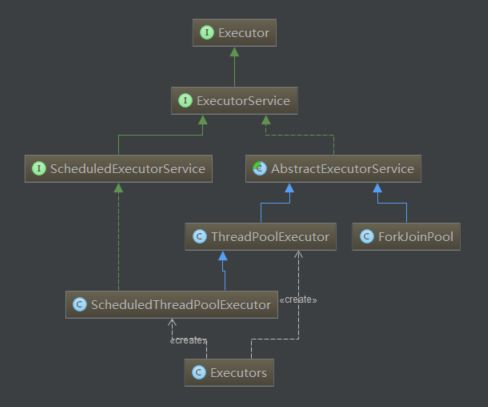

title: Java 线程及线程池
date: 2018-04-10
tags: 线程, 线程池, AsyncTask, Handler Thread
cover: ../images/java 线程池框架.jpg

### 1. Java 线程池

#### 1.1 java 线程池框架的主要类和接口



-   Executor 接口定义了执行器 Runnable 执行方式
-   ExecutorService 定义了线程具体接口
-   ScheduledExecutorService 定义了定时执行线程的接口
-   AbstractExecutorService 线程池的实现的抽象类
-   ThreadPoolExecutor 线程池的具体实现类
-   ScheduledThreadPoolExecutor 定时线程池的实现类
-   Executors 线程池的辅助工具类

#### 1.2 Executors 辅助类主要几种线程池模型

-   `newCachedThreadPool` 可缓存的无界线程池, 当一个新请求到来时, 如果没有缓存线程则新建一条线程来处理. 如果有则用缓存线程. 处理完成后, 空闲线程会被缓存, 如果超时前没有被用来处理请求, 则该线程会被回收. 这个模型的线程池是 `Integer.MAX_VALUE` 可以看作是无限大小的
-   `newFixedThreadPool` 固定大小的线程池, 对于没有线程处理的请求会在 `LinkedBlockingQueue` 中等待处理
-   `newSingleThreadExecutor` 单一线程的线程池, 请求会被按队列顺序处理
-   `newScheduledThreadPool` 固定大小, 可定时或周期执行的任务的线程池

| 工厂方法                | corePoolSize | maximumPoolSize   | keepAliveTime | workQueue           |
| ----------------------- | ------------ | ----------------- | ------------- | ------------------- |
| newCachedThreadPool     | 0            | Integer.MAX_VALUE | 60s           | SynchronousQueue    |
| newFixedThreadPool      | nThreads     | nThreads          | 0             | LinkedBlockingQueue |
| newSingleThreadExecutor | 1            | 1                 | 0             | LinkedBlockingQueue |
| newScheduledThreadPool  | corePoolSze  | Integer.MAX_VALUE | 0             | DelayedWorkQueue    |

#### 1.3 ThreadPoolExecutor 类

构造方法

```java
public ThreadPoolExecutor(int corePoolSize, int maximumPoolSize, long keepAliveTime,
		TimeUnit unit, BlockingQueue<Runnable> workQueue, ThreadFactory threadFactory,
		RejectedExecutionHandle rejectedHandler);
```

-   corePoolSize: 线程池的基本大小, **必须 >= 0**. 当有请求到来时, 若当前线程池中的线程数小于该值, 即使有空闲线程存在也会创建新的线程来处理该请求. 当线程数大于等于这个数值时, 才会根据是否存在空闲线程来决定是否创建新线程.
-   maximumPoolSize: 线程池的最大大小, **必须 >= 1**. 当线程池中的线程数等于该值时, 请求会被加入到请求队列, 等待有空闲线程来处理该请求
-   keepAliveTime: 空闲线程存活时间, **必须 >= 0**
-   unit: 存活时间的时间单位
-   workQueue: 任务队列, 不能为空.
    -   ArrayBlockingQueue: 基于数组的有界阻塞队列.
    -   LinkedBlockingQueue: 基于链表的无界阻塞队列.
    -   SynchronousQueue: 同步阻塞队列. 每插入一个元素必须等待另一个对应的删除操作完成
    -   PriorityBlockingQueue: 基于优先级的无界阻塞队列.
-   threadFactory: 线程工厂, 有默认的工厂方法 `DefaultThreadFactory` 类. 用来新创建线程
-   rejectedHandler: 线程饱和策略, 默认为 `ThreadPoolExecutor.AbortPolicy`. 当请求无法加入到请求队列时, 请求被拒绝时的处理方法

#### 1.4 线程池执行策略

1. 当新的请求到来时, 判断是否大于 coreSize, 大于则加入请求队列, 小于则直接新创建线程来处理
2. 判断空闲线程. 当线程池中的数量 < maximum 时, 创建新的线程来处理队列中的任务
3. 判断能否加入到队列中, 不能则直接使用拒绝请求设置的策略, 能则等待空闲线程
4. 当无法创建新线程时, 不能加入到队列中的任务将被拒绝执行

### Reference:

1. [http://gityuan.com/2016/01/16/thread-pool](http://gityuan.com/2016/01/16/thread-pool/)
