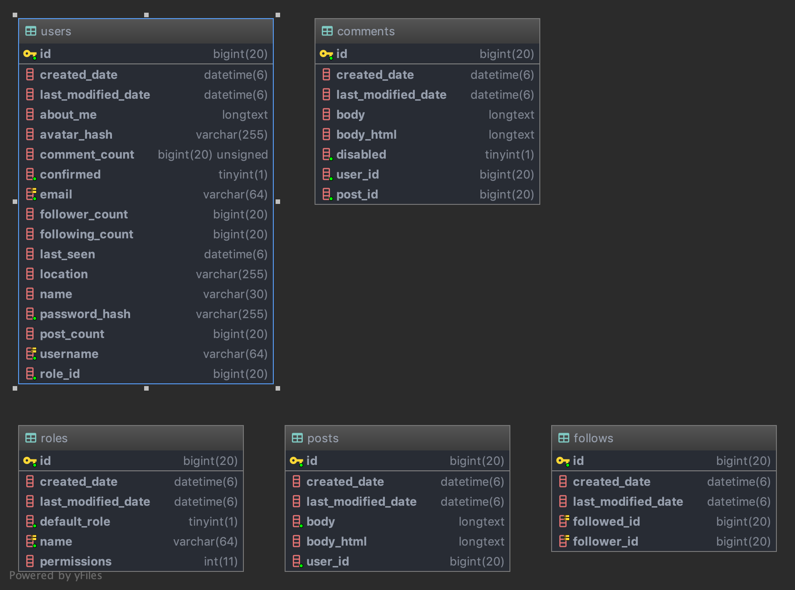

title: Spring Flasky 开发(一)
date: 2019-05-02
tags: spring boot, flasky
cover: ../../assets/images/flasky.png

### 1. 项目说明

Flasky 是 [Flask Web Development](https://book.douban.com/subject/26274202/) 里的一个实例项目, 原项目是使用 Python 开发了, 一个类似微博的小型项目, 我用 Spring Boot 重写了一个
实现了里面提到了主要功能:

- [x] Post 分页, 及在登录后查看关注的人发的 Post
- [x] 帐号注册, 登录, 发 Post, 对他人 Post 的评论
- [x] 个人信息页
- [x] 权限系统, 帐号角色分配
- [x] 邮件发送系统, 通过邮件激活帐号, 重置密码
- [x] 关注, 取消关注功能
- [ ] Rest API

### 2. 主要依赖

- Spring Boot
- Spring Security 用于权限控制, 登录
- Spring Data JPA 数据库查询 ORM
- Thymeleaf 模版引擎
- MySQL 数据库
- OhMyEmail 最简单邮箱发送系统

### 3. 数据库模型



- `users` 用户表, 有几个冗余的设计, 比如常用到的关注, 被关注数量, 发表 post 数量, 评论数量等
- `comments` 评论表, 和 posts, users 都是多对一关系
- `roles` 角色权限表, permissions 是一个 32 位的 int, 每位代表一个权限, 默认初始三种角色
- `posts` post 内容, 和 users 是多对一关系
- `follows` 关注映射表, followed_id, follower_id 都是 users.id, 表 users 是一个自身多对多的关系

> 由于我们需要对 `follows` 表添加一些额外的字段, 所以在 Spring JPA 的关系映射中, `User` 和 `Follow` 这两个实体是一个多对一个关系, 在 `User` 实体中, 不再用 **多对多** 的关系表示

### 4. 实体类

主要注意要自己定义 follows 表实体类, `follower` 是关注者, `followed` 是被关注者, 多对多的中间映射表是自己定义的, 所以 `User` 中不再定义多对多的映射

```java
public class Follow extends BaseDomain {

    private static final long serialVersionUID = -119359227790097339L;

    // 两个多对一关系, 一个关注者 id, 一个是被关注者 id
    @ManyToOne
    @JoinColumn(name = "follower_id", foreignKey = @ForeignKey(ConstraintMode.NO_CONSTRAINT))
    private User follower;

    @ManyToOne
    @JoinColumn(name = "followed_id", foreignKey = @ForeignKey(ConstraintMode.NO_CONSTRAINT))
    private User followed;
}
```

`User` 中和 `Role` 的多对一关系

```java
public class User {
    @ManyToOne
    @JoinColumn(name = "role_id", nullable = false, foreignKey =       @ForeignKey(NO_CONSTRAINT))
    private Role role;
}
```

`Post` 和 `User` 的多对一关系

```java
public class Post extends BaseDomain implements Serializable {

    private static final long serialVersionUID = -6830098959594362217L;

    @ManyToOne(fetch = FetchType.LAZY)
    @JoinColumn(name = "user_id", nullable = false, foreignKey = @ForeignKey(NO_CONSTRAINT))
    private User author;
}
```

`Comment` 和 `User`, `Post` 的多对一关系

```java
public class Comment extends BaseDomain implements Serializable {

    private static final long serialVersionUID = -1029418689058348694L;

    @ManyToOne(fetch = FetchType.LAZY)
    @JoinColumn(name = "user_id", nullable = false, columnDefinition = "bigint",
            foreignKey = @ForeignKey(NO_CONSTRAINT))
    private User author;

    @ManyToOne(fetch = FetchType.LAZY)
    @JoinColumn(name = "post_id", nullable = false, columnDefinition = "bigint",
            foreignKey = @ForeignKey(NO_CONSTRAINT))
    private Post post;
}
```

定义一个 `Permission`, 用于映射权限, 当有权限增改时, 修改这个类即可

```java
public enum Permission {
    /**
     * 关注权限
     */
    FOLLOW(0x01, "FOLLOW"),

    /**
     * 评论权限
     */
    COMMENT(0x02, "COMMENT"),

    /**
     * 写 post 权限
     */
    WRITE(0x04, "WRITE"),

    /**
     * 修改他人信息的权限,
     */
    MODERATE(0x08, "MODERATE"),

    /**
     * 管理员权限
     */
    ADMIN(0xff, "ADMIN");
```

项目地址: [https://github.com/ivicel/spring-flasky](https://github.com/ivicel/spring-flasky)